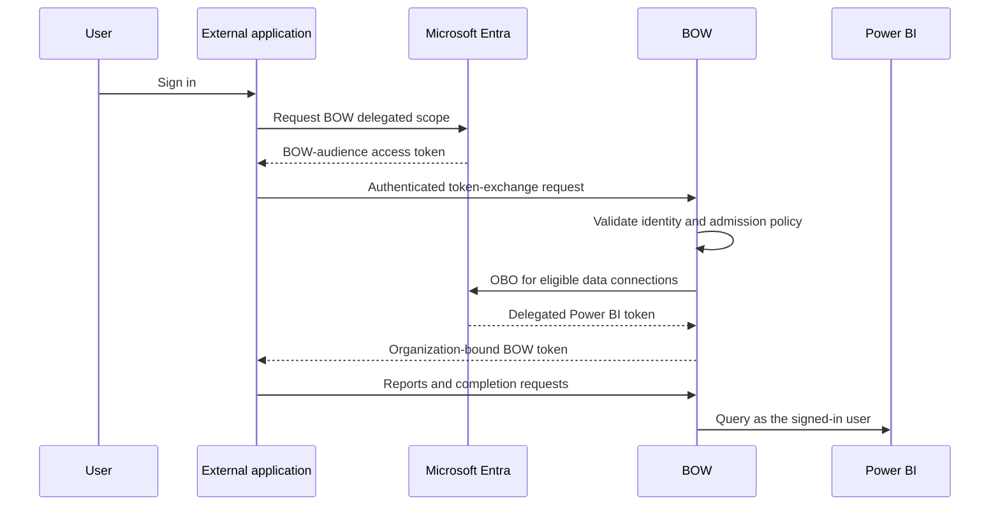

Use this flow when your application already signs users in with Microsoft Entra ID and calls BOW from its backend. The user signs in to your application; BOW admits eligible users and provisions their delegated data connection without a separate BOW sign-in screen.

This is optional per [OAuth app](/channels/oauth-apps). Authorization Code + PKCE and refresh-token applications continue to work without enabling it.

## The three registrations

| Registration | Purpose | Where its credentials belong |
| --- | --- | --- |
| External Entra application | Signs users into your application and requests BOW's delegated scope | Your application backend |
| BOW Entra application | Identifies BOW's API and performs downstream OBO | BOW's SSO configuration and matching data connection |
| BOW custom OAuth app | Authorizes your backend to exchange Entra tokens in one BOW organization | Your application backend |

The external Entra client ID differs from the BOW Entra client ID. The field **External Entra application (client) ID** contains the external application's ID.



## Prerequisites

- A tenant-specific Microsoft Entra SSO provider configured in BOW. This flow supports the Microsoft public cloud and tenant GUID authorities.
- Your external app has delegated consent for `api://BOW_ENTRA_CLIENT_ID/access_as_user`.
- The BOW Entra registration has the delegated permissions and consent required by the [Power BI connector](/data-sources/connectors/power-bi) or [Fabric connector](/data-sources/connectors/microsoft-fabric).
- Each user has the required permissions on the underlying Microsoft data.
- New users have a valid invitation to the OAuth app's BOW organization, or that organization has enabled domain signup for their Entra login domain. Domain signup requires the corresponding BOW license feature.
- Your application has a backend that can protect both its Entra secret and its BOW custom-app secret.

Microsoft may still require MFA, consent, or another interactive step under its policies. A pre-existing Microsoft session alone does not provide a token for BOW.

## Configure BOW's Entra provider

Merge this provider into your existing `bow-config.yaml`; keep your database, encryption, license, and other settings.

```yaml
auth:
  mode: hybrid

oidc_providers:
  - name: entra
    label: Microsoft
    enabled: true
    issuer: https://login.microsoftonline.com/TENANT_ID/v2.0
    client_id: BOW_ENTRA_CLIENT_ID
    client_secret: ${BOW_ENTRA_CLIENT_SECRET}
    scopes:
      - openid
      - profile
      - email
      - api://BOW_ENTRA_CLIENT_ID/access_as_user
    pkce: true
    client_auth_method: post
    discovery: true
    uid_claim: sub
```

Replace the uppercase ID placeholders with GUIDs. Set the secret through the deployment's environment. The provider uses the **BOW Entra application's** credentials.

For ordinary interactive BOW SSO, register `https://YOUR_BOW_HOST/api/auth/entra/callback` on the BOW Entra registration. The external application's Microsoft callback belongs on the **external** Entra registration and points to your application, for example `http://localhost:3000/entra/callback` in development.

These are separate from the callback URIs used by BOW's Authorization Code + PKCE flow.

## Register the custom app in BOW

1. Open **Settings → Channels → OAuth Apps** and select **Register app**, or edit an existing app.
2. Select **BOW app** for reports and completions.
3. Enable **Enable Entra token exchange**.
4. Select the configured **Entra SSO provider**.
5. Enter the **External Entra application (client) ID**.
6. Copy the displayed tenant ID and required scope into your external application's configuration.
7. Save and store the BOW client ID and one-time secret on your backend.

Redirect URIs are optional for an exchange-only application. Keep them if the same registration also uses Authorization Code + PKCE. **Trusted** controls consent for the redirect flow; enabling Entra exchange separately authorizes the server-to-server exchange.

## Configure admission and the data connection

For a new user, BOW checks the target organization's existing rules:

- A current invitation is accepted and its assigned roles and groups are applied.
- Otherwise, an enabled domain signup policy must admit the user's Entra login domain. The configured signup role and seat limits apply.
- If neither applies, the exchange fails without creating a user.

No separate BOW signup is needed. New identities are bound to their Entra tenant and object ID. An email collision with an existing, unlinked BOW account fails closed; an administrator must resolve that identity link. Disabled users and removed memberships are not silently restored by exchange.

Configure the Power BI connection for per-user OAuth. Its tenant and client ID must match the selected BOW Entra provider; its secret belongs to that same BOW Entra application. An unrelated app registration on the connection will not be provisioned by this flow.

BOW provisions eligible missing credentials before returning the exchanged token. Existing credentials and explicit Disconnect choices are preserved. A successful BOW exchange does not grant permissions on Microsoft data that the user lacks.

## Request and exchange the token

Have your external application's Microsoft authentication library acquire a delegated **access token** for:

```text
api://BOW_ENTRA_CLIENT_ID/access_as_user
```

Do not submit an ID token, a Microsoft Graph token, an app-only token, or a token whose audience is your external application's own API. BOW checks the issuing tenant, signature, lifetime, audience, delegated scope, and calling application (`azp` for v2 tokens or `appid` for v1 tokens).

From your backend:

```python
import httpx

response = httpx.post(
    f"{BOW_URL}/api/oauth/token",
    data={
        "grant_type": "urn:ietf:params:oauth:grant-type:token-exchange",
        "client_id": BOW_CUSTOM_APP_CLIENT_ID,
        "client_secret": BOW_CUSTOM_APP_SECRET,
        "subject_token_type": "urn:ietf:params:oauth:token-type:access_token",
        "subject_token": entra_access_token,
        "scope": "app",
    },
    timeout=150,
)
response.raise_for_status()
tokens = response.json()
```

The response has an access token, `token_type: Bearer`, `issued_token_type`, `expires_in`, and `scope`. It has no BOW refresh token. Its lifetime is at most one hour and never longer than the submitted Entra token's remaining lifetime.

Send it as `Authorization: Bearer ...` when calling the [report and streaming completion APIs](/guides/embed). The organization is pinned to the custom app; an organization header cannot switch it.

When renewal is needed, your backend acquires a fresh Entra access token through its Microsoft authentication library and exchanges it again. BOW does not store the incoming Entra assertion.

## Verify the complete flow

Use a test account that has never registered with BOW:

1. Invite the account or enable domain signup for its domain.
2. Sign in only through the external application.
3. Exchange the access token and call `GET /api/users/whoami` with the returned BOW token.
4. Check that one BOW user and one membership were created with the intended role.
5. Run a small read-only Power BI query through the intended agent.
6. Repeat the exchange and verify that it reuses the same user.
7. Verify that a non-invited account from a disallowed domain is rejected.

A runnable development example is available in the repository at `tools/agent/entra_exchange_demo.py`. It uses a loopback callback, PKCE and state, and keeps tokens on the local server.

## Troubleshooting

| Result | Check |
| --- | --- |
| `invalid_client` | BOW custom-app client ID and secret; the external Entra secret does not go here |
| `unauthorized_client` | Exchange enabled on this app; selected provider still enabled and unchanged |
| `invalid_grant` before admission | Token audience, tenant, signature, expiry, delegated scope, and external client ID |
| Invitation/domain error | Invitation expiry, target organization, enabled domain signup and license |
| Existing-account link error | Resolve the existing BOW account's Entra identity; email alone cannot claim it |
| Downstream authorization error | Matching connection app/tenant, valid BOW Entra secret, downstream consent, Conditional Access |
| HTTP 503 with `Retry-After` | Retry with bounded backoff; another provisioning job or temporary Entra failure may be in progress |
| BOW API works but Power BI denies a query | The user's dataset/workspace permissions and Power BI requirements; inspect the actual connector error |

Changing or disabling the Entra exchange configuration invalidates tokens issued through that configuration. Existing Authorization Code + PKCE tokens are unaffected by an exchange-only settings change. Changing access surfaces retains the existing behavior of revoking that app's grants and tokens.

## Appendix: expose and grant access_as_user

On the **BOW Entra application**:

1. Open **App registrations → your BOW application → Expose an API**.
2. Set the Application ID URI to `api://BOW_ENTRA_CLIENT_ID`.
3. Add an enabled scope named `access_as_user`, with a clear description such as “Access BOW as the signed-in user.” Choose the consent policy appropriate for your tenant.

On the **external Entra application**:

1. Open **API permissions → Add a permission → My APIs**.
2. Select the BOW API, choose **Delegated permissions**, and select `access_as_user`.
3. Add the permission and arrange the required administrator consent.

Then request the full scope URI in the external app. Adding a permission in the portal does not automatically request it at runtime. See Microsoft's instructions for [exposing a web API](https://learn.microsoft.com/en-us/entra/identity-platform/quickstart-configure-app-expose-web-apis) and [granting a client access](https://learn.microsoft.com/en-us/entra/identity-platform/quickstart-configure-app-access-web-apis).

The BOW Entra application's downstream Power BI/Fabric permissions are a separate grant from the external application's permission to call BOW.
