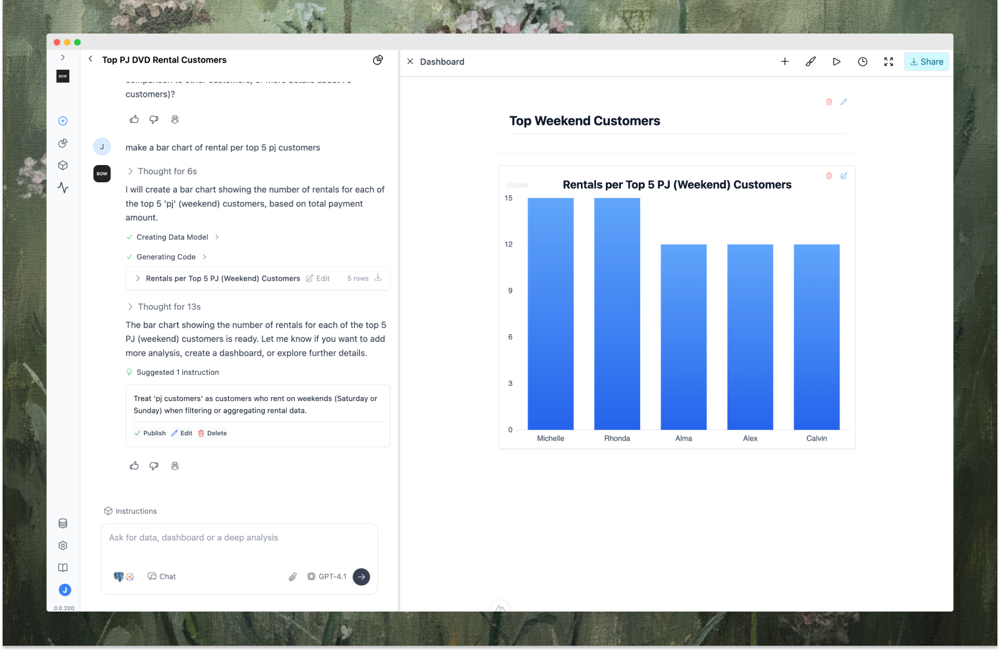

<video
  controls
  className="w-full aspect-video"
  src="./assets/media/hero2.mp4"
></video>

* **Chat with any data source** 

  Ask questions in web, Slack, or else. Create charts, tables, and full beautiful reports/dashboards by chatting with your data—powered by an agentic loop for tool use, reflection, and reasoning.

*  **Context-aware & customizable** 
  
   Define terms, KPIs, rules and instructions. Ingest from dbt, Tableau, code, AGENTS.md, and have AI continiously maintain and monitor.

* **Any LLM, any data**

   Connect multiple data sources: Snowflake, BigQuery, Redshift, Postgres, dbt, Tableau, and more — then pair with the LLM of your choice (OpenAI, Anthropic, or local models). Swap models/data sources without breaking workflows.

*  **Transparency, trust & deployment**

   Track every AI decision, trace, and feedback. Analyze quality and usage in the console. Deploy fully in your VPC with Docker/Compose, VMs, or Kubernetes. Enterprise-ready with RBAC, SSO (OIDC), audit logs, SMTP.
<Card title="hello world" icon='brain'>
Hello World
</Card>

<Card title="hello world" icon='brain'>
Hello World
</Card>

## Concepts

<Columns cols={3}>
  <Card title="hello world">
    Set up your project with our quickstart guide.
  </Card>
  <Card title="API reference">
    Explore endpoints, parameters, and examples for your API.
  </Card>
    <Card title="API reference">
    Explore endpoints, parameters, and examples for your API.
  </Card>
</Columns>

## Product Overview

### Chat with any data
Create reports, deep analysis or quick visuals with an AI interface powered by an agentic-loop with tools, reasoning and reflection built in. 

### Create and customize AI instructions and rules
Manage your AI rules and instructions with review process and control

### Connect dbt, Tableau, and more for better AI context
Enrich your AI context with dbt models, Tableau data sources, AGENTS.md and your git repo

### Monitor AI and data operations
Full observability into queries, feedback, and context — powering self-learning and high quality AI results
