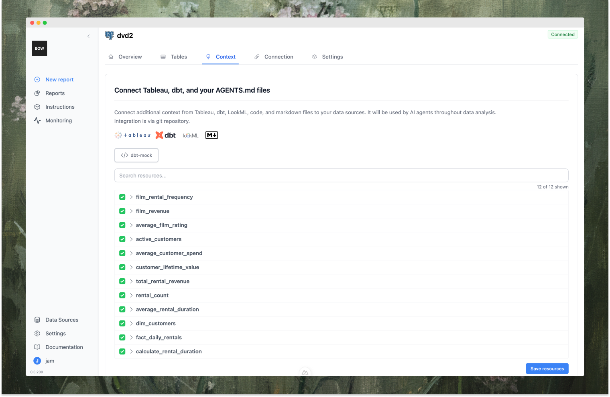

<video
  controls
  className="w-full aspect-video rounded-xl"
  src="https://bagofwords.com/demos/hero2.mp4"
></video>

* **Chat with any data source** 

  Ask questions in web, Slack, or else. Create charts, tables, and full beautiful reports/dashboards by chatting with your data—powered by an agentic loop for tool use, reflection, and reasoning.

*  **Context-aware & customizable** 
  
   Define terms, KPIs, rules and instructions. Ingest from dbt, Tableau, code, AGENTS.md, and have AI continiously maintain and monitor.

* **Any LLM, any data**

   Connect multiple data sources: Snowflake, BigQuery, Redshift, Postgres, dbt, Tableau, and more — then pair with the LLM of your choice (OpenAI, Anthropic, or local models). Swap models/data sources without breaking workflows.

*  **Transparency, trust & deployment**

   Track every AI decision, trace, and feedback. Analyze quality and usage in the console. Deploy fully in your VPC with Docker/Compose, VMs, or Kubernetes. Enterprise-ready with RBAC, SSO (OIDC), audit logs, SMTP.

## Getting Started 

<Columns cols={3}>
  <Card title="Chat with Data" icon="bot" href="/using-bow/reports">
    Ask questions, create visualizations, and run deep analysis through natural language
  </Card>
  <Card title="Instructions" icon="box" href="/using-bow/instructions">
    Guide your AI agent with custom instructions for better, more accurate results
  </Card>
  <Card title="Data Sources" icon="database" href="/using-bow/data_source">
    Connect any data warehouse, database, or data service to Bag of words
  </Card>
</Columns>
<Columns cols={3}>
  <Card title="Dashboards" icon="chart-pie" href="/using-bow/dashboards">
    Build visual stories by combining charts, tables, and explanatory text
  </Card>

  <Card title="Context" icon="layers" href="/core/context">
    How Bag of words constructs and manages context for every Agent run
  </Card>
  <Card title="Monitoring" icon="activity" href="/core/monitoring">
    Track accuracy, context quality, and agent behavior across your AI data layer
  </Card>
</Columns>

## Product Overview

### Chat with any data
Create reports, deep analysis or quick visuals with an AI interface powered by an agentic-loop with tools, reasoning and reflection built in. 

### Create and customize AI instructions and rules
Manage your AI rules and instructions with review process and control

### Connect dbt, Tableau, and more for better AI context
Enrich your AI context with dbt models, Tableau data sources, AGENTS.md and your git repo

### Monitor AI and data operations
Full observability into queries, feedback, and context — powering self-learning and high quality AI results
